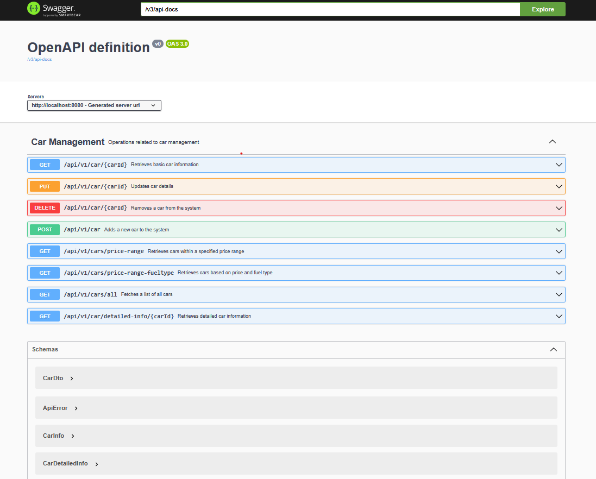
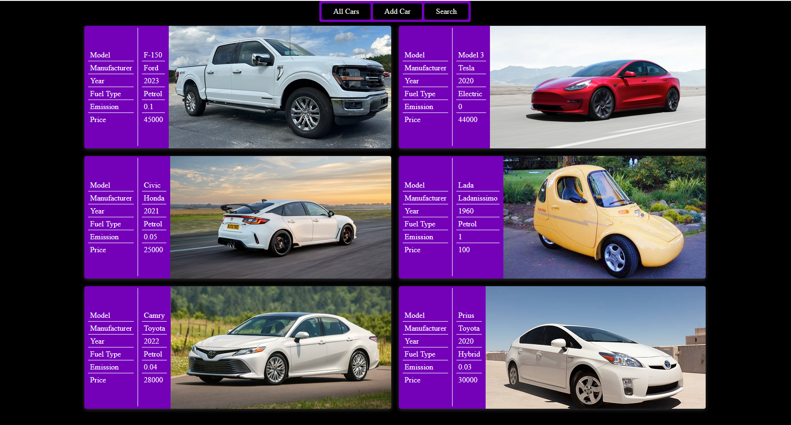
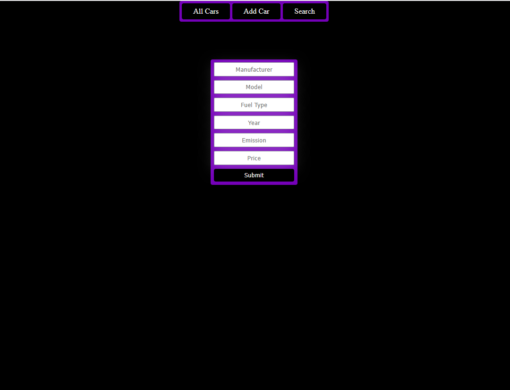
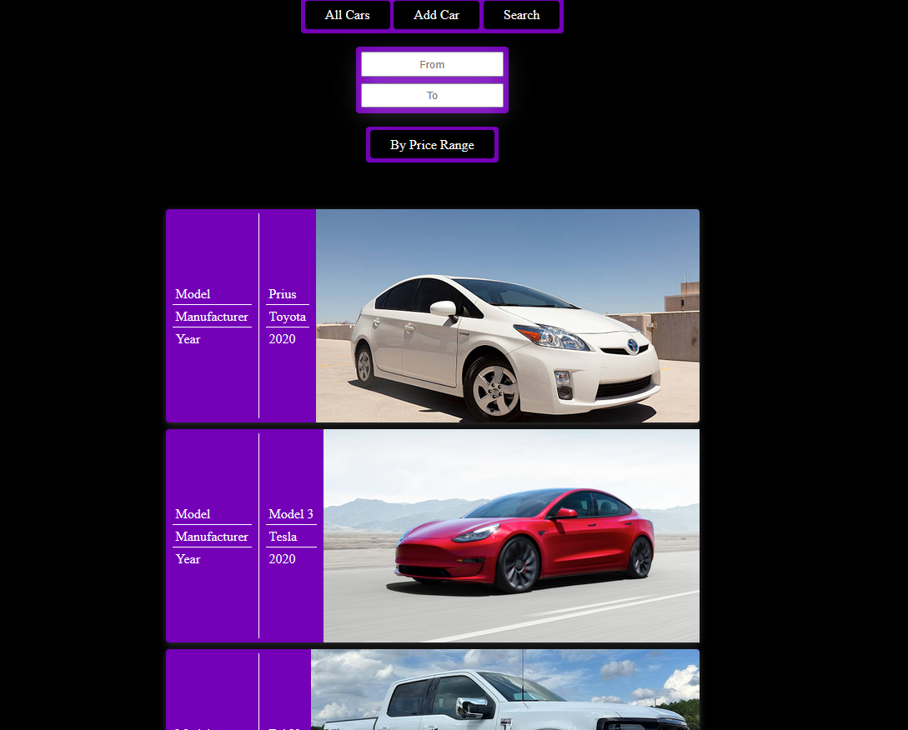

# CarPortal project

## Project Description

BCS Koolitus Car Portal project where we had to create API REST/CRUD endpoints with SWAGGER OpenAPI descriptions.

### Tech Stack:

-   **Frontend**: React, TypeScript
-   **Backend**: Java Spring-Boot
-   **Database**: PostgreSQL

## Table of Contents

-   [How to Run the Project](#how-to-run-the-project)
    -   [Run Locally](#run-locally)
-   [Screenshots](#screenshots)
-   [Usage](#usage)
-   [Contributing](#contributing)
-   [License](#license)
-   [Contact](#contact)

## How to Run the Project

To run the project locally, follow these steps:

#### Prerequisites

-   Java 21 dependencies installed.
-   IntelliJ installed.
-   Docker installed for PostgreSQL database.

#### Steps

1. **Start the PostgreSQL database**:

    ```bash
    docker run --name postgres -e POSTGRES_PASSWORD=student123 -p 5432:5432 -d postgres
    ```

1. **Clone the backend repository**:

    ```bash
    git clone https://github.com/The-Estonian/carportal
    cd carportal
    ```

1. **Run the backend**:

    - Open the first terminal

    ```bash
    gradlew bootRun
    ```

1. **Clone the frontend repository**:

```bash
   git clone https://github.com/The-Estonian/carportal_frontend
   cd carportal_frontend
```

4. **Run the frontend**:
    - Open the second terminal
    ```bash
    npm install
    npm run dev
    ```

## Screenshots

Here's screenshots of the project:






## Usage

After running the project locally, you can see predefined cars or add new ones. You can also search between the cars in the database.

## Contributing

We welcome contributions! Please contact one of the authors in discord if you would like to contribute to future projects.

## License

This project is licensed under the MIT License. See the [LICENSE](https://opensource.org/license/mit) file for details.

## Contact

For any questions or suggestions, feel free to contact me directly in Discord: [here](https://discord.gg/5AnHPtVJPw)

## Nota Bene

The project is still a work in progress, has some bugs and could also hold more simple games in the future with some new minor bugs.

_Authors: [Jaanus Saar](https://github.com/The-Estonian)_
